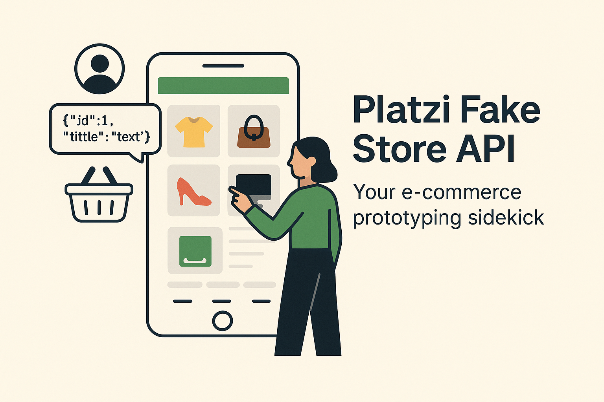

# 🛍️ Platzi Fake Store API Client

A modern SwiftUI iOS application built to interact with the [Platzi Fake Store API](https://fakeapi.platzi.com/en). This app is a great starting point for learning e-commerce app architecture, networking with `async/await`, and working with JWT-based authentication.

---

## 🚀 Features

- 📦 Fetch and display products by category
- 🔍 View detailed product information
- 🧾 Register and authenticate users (JWT support)
- 🔐 Secure token storage via Keychain
- 🛒 Add, update, and delete items in the shopping cart
- ⚙️ Modular architecture with Stores, Controllers, DTOs, and Mocks
- 🧪 Mock responses for SwiftUI previews and testing

---

## 🧰 Tech Stack

- **Language**: Swift 5+
- **Frameworks**: SwiftUI, Foundation
- **Data Storage**: Keychain, Codable models
- **Architecture**: MV-like modular structure
- **Networking**: Custom `HTTPClient` using async/await
- **Preview Support**: `MockHTTPClient` for UI testing

---

## 📁 Project Structure

``` 
Platzi/
├── Controllers/ # Authentication, Product logic
├── DTOs/ # Data Transfer Objects
├── Errors/ # Custom error types
├── Extensions/ # Swift helpers/extensions
├── Mocks/ # JSON mock data and mock clients
├── Networking/ # HTTPClient, Resource, Endpoints
├── Screens/ # SwiftUI views grouped by feature
├── Stores/ # ObservableObjects for state management
├── Utils/ # JWT decoding, token handling
├── View Modifiers/ # Custom SwiftUI modifiers
├── Images/ # App images and promotional material
└── PlatziApp.swift # Main entry point
```

🧑‍💻 Author
Built with ❤️ by Mohammad Azam


📄 License
This project is licensed under the MIT License.
